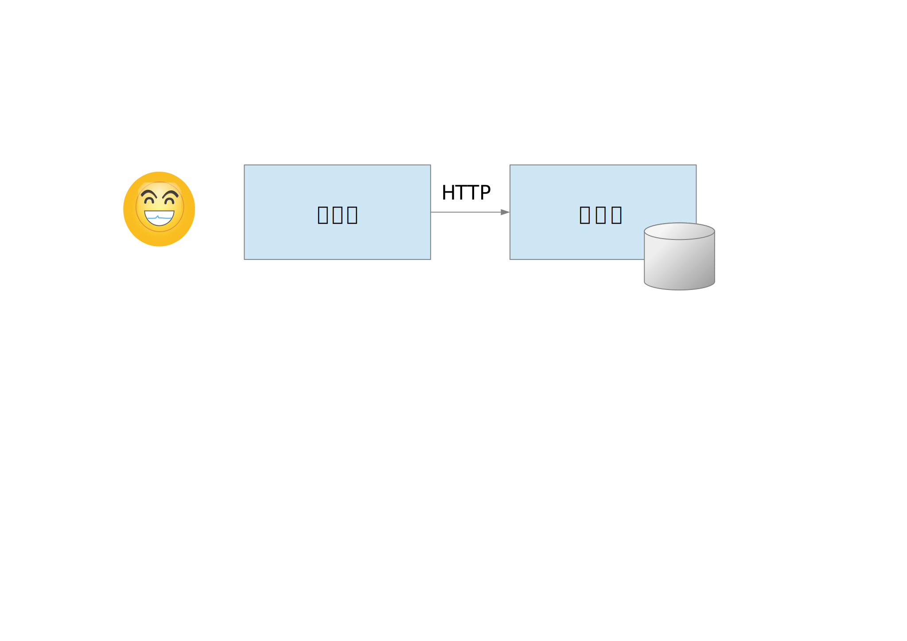
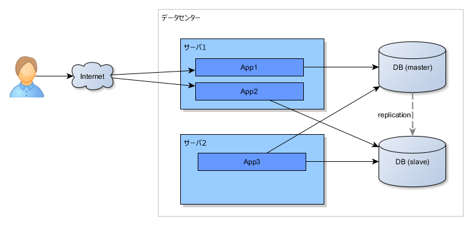
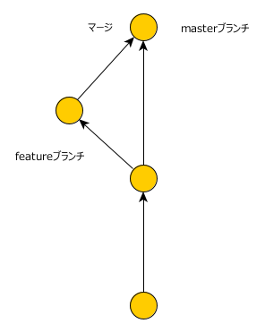
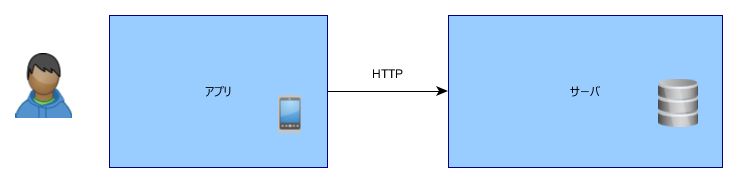
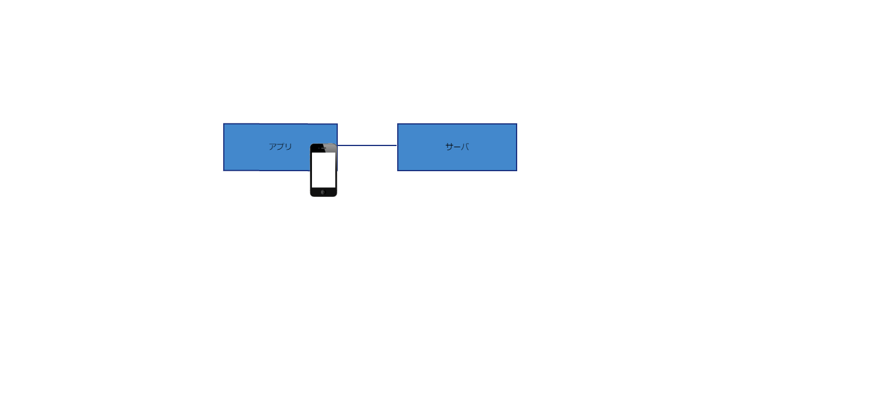
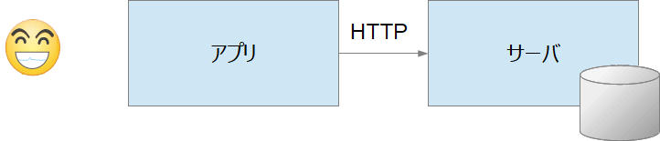
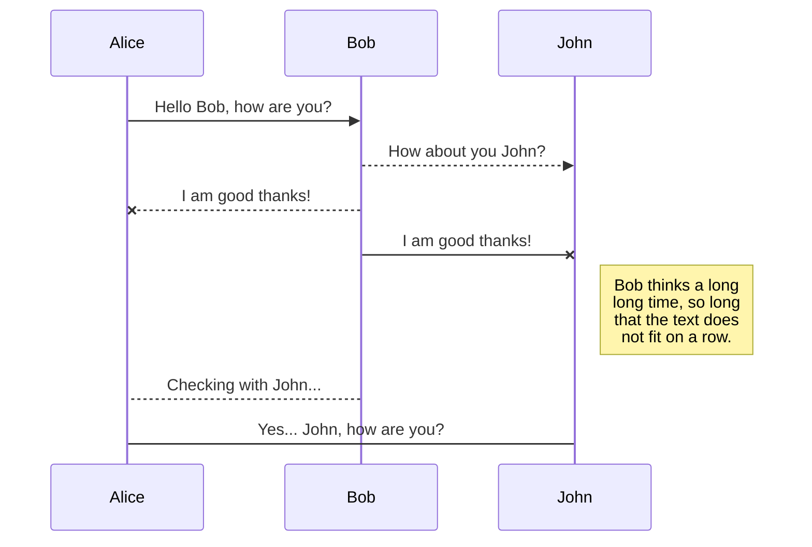
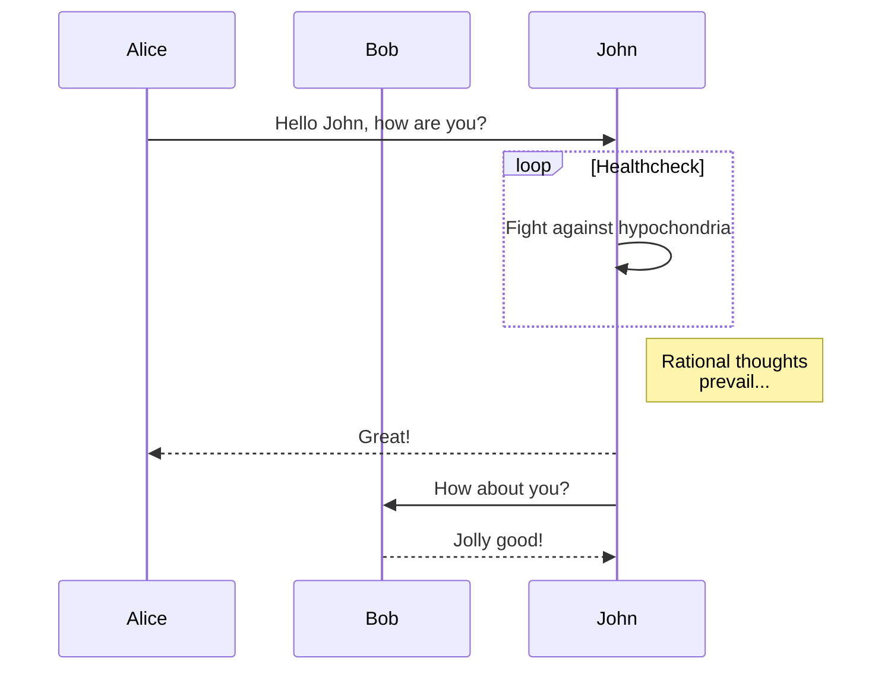
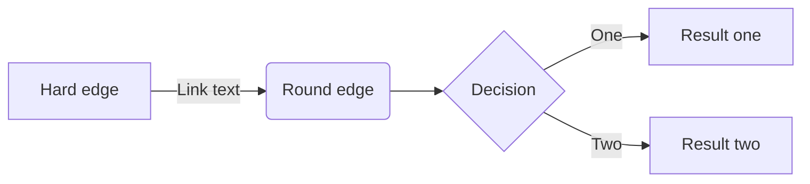

# Markdown ドキュメント

> このリポジトリは GitLab で管理し GitHub へミラーリングしています。

## 箇条書き

- A であること
- B であること

## 表

|            | 状況 |
| ---------- | ---- |
| GitLab     | o    |
| GitHub     | o    |
| VSCode MPE | o    |
| Typora     | o    |

| Left Aligned | Centered | Right Aligned | Left Aligned | Centered | Right Aligned |
| :----------- | :------: | ------------: | :----------- | :------: | ------------: |
| Cell 1       |  Cell 2  |        Cell 3 | Cell 4       |  Cell 5  |        Cell 6 |
| Cell 7       |  Cell 8  |        Cell 9 | Cell 10      | Cell 11  |       Cell 12 |

## 脚注

|            | 状況 |
| ---------- | ---- |
| GitLab     | o    |
| GitHub     | x    |
| VSCode MPE | o    |
| Typora     | △    |

この脚注は GitLab 用のもので、GitHub では動作しない。Typora ではポップアップ表示されるが脚注部分がそのままの位置に表示される。[^2]
[^2]: これは脚注です。

## details と summary

|            | 状況 |
| ---------- | ---- |
| GitLab     | o    |
| GitHub     | o    |
| VSCode MPE | o    |
| Typora     | x    |

この部分は GitLab、GitHub では展開/折りたたみ可能だがTyporaでは常に展開してしまう

These details _will_ remain **hidden** until expanded.

    PASTE LOGS HERE

## タスク

|            | 状況 |
| ---------- | ---- |
| GitLab     | o    |
| GitHub     | o    |
| VSCode MPE | o    |
| Typora     | o    |

- [x] Completed task
- [ ] Incomplete task
  - [ ] Sub-task 1
  - [x] Sub-task 2
  - [ ] Sub-task 3

## 図

### SVG

|            | 表示 |
| ---------- | ---- |
| GitLab     | x    |
| GitHub     | o    |
| VSCode MPE | o    |
| Typora     | o    |

#### yEd による SVG

---

#### Pencil による SVG

#### LibreOffice Draw による SVG

#### OpenOffice Draw による SVG

### PNG

|            | 表示 |
| ---------- | ---- |
| GitLab     | o    |
| GitHub     | o    |
| VSCode MPE | o    |
| Typora     | o    |

#### yEd による PNG

---

---

#### Pencil による PNG

#### LibreOffice Draw による PNG

#### OpenOffice Draw による PNG

## mermaid

|            | 図の表示 |
| ---------- | -------- |
| GitLab     | o        |
| GitHub     | x        |
| VSCode MPE | o        |
| Typora     | o        |

### シーケンス図

---

#### フローチャート

