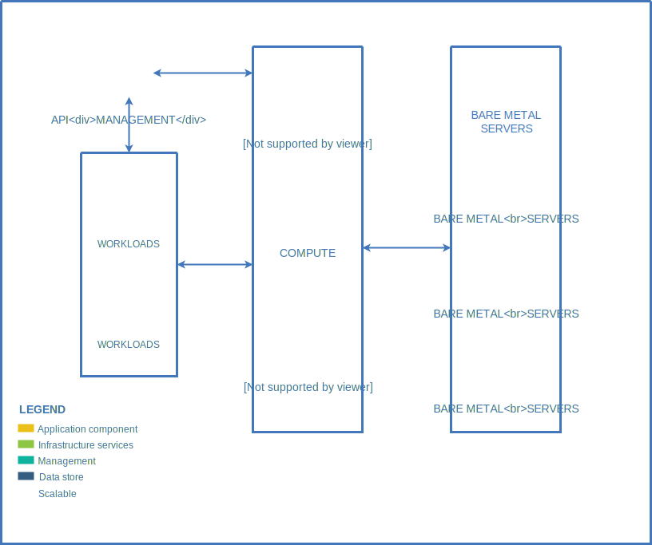
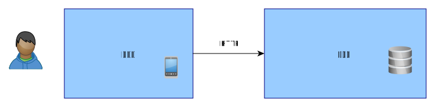
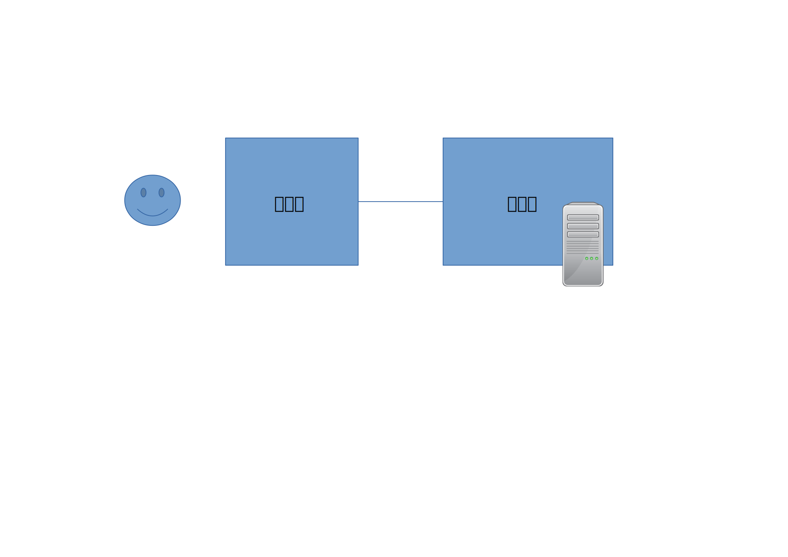
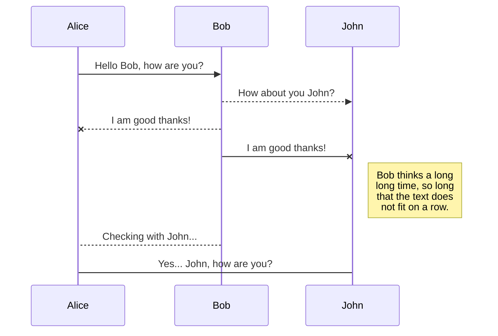
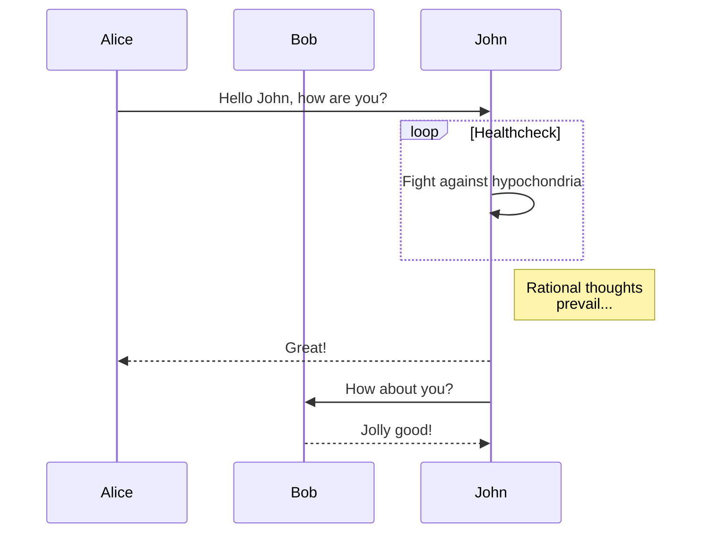
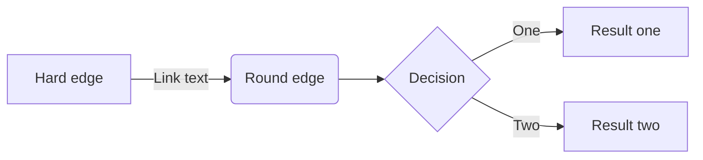

# ヘッダ

## 構成

## 仕様

- A であること
- B であること

| 項目 | 説明 |
| ---- | ---- |
| a    | 1    |
| b    | 2    |

| Left Aligned | Centered | Right Aligned | Left Aligned | Centered | Right Aligned |
| :----------- | :------: | ------------: | :----------- | :------: | ------------: |
| Cell 1       |  Cell 2  |        Cell 3 | Cell 4       |  Cell 5  |        Cell 6 |
| Cell 7       |  Cell 8  |        Cell 9 | Cell 10      | Cell 11  |       Cell 12 |

You can add footnotes to your text as follows.[^2]
[^2]: This is my awesome footnote.

Click me to collapse/fold.

These details _will_ remain **hidden** until expanded.

    PASTE LOGS HERE

- [x] Completed task
- [ ] Incomplete task
  - [ ] Sub-task 1
  - [x] Sub-task 2
  - [ ] Sub-task 3

## 図

---

---

---

---

## mermaid

---

---

